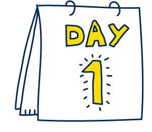

## Day 1 w/DC

 
 Got to meet everyone! Went over some command line basics.

    

    
        
## Key Notes:
        
            1. Stay Organized! (Directories and Folders)
            2. Use Terminal for git init/creation
            3.Utilize instructor notes
          
### On to Day 2!